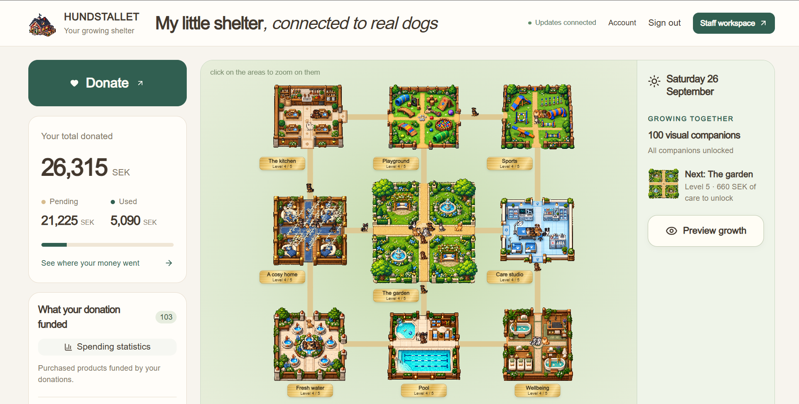
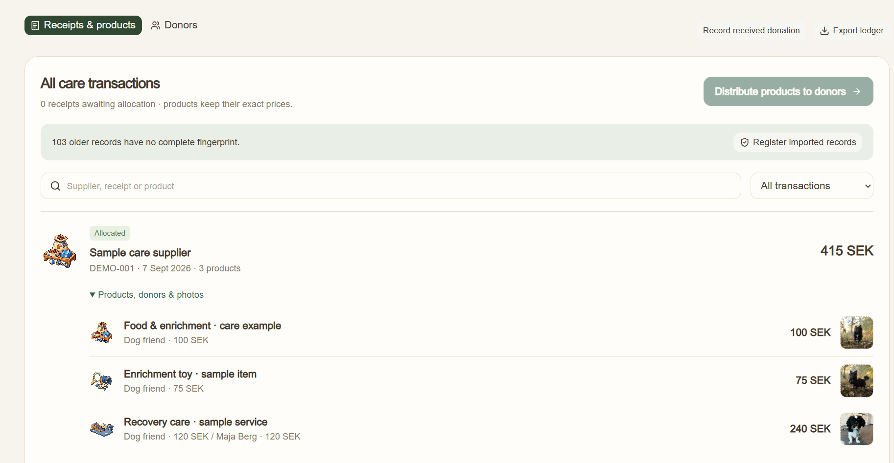

# Hundstallet Care Platform

A hackathon prototype that makes giving to Hundstallet more engaging, transparent and easier to manage. Donors can follow their contribution from a received donation to real care purchases, while employees get a practical invoice and allocation workflow.

> This is a local demonstration project. It is not connected to real payments or Hundstallet's production systems.

## The problem

Animal shelters depend on donations, but donors do not always get a clear view of how their gift helps. At the same time, employees need a simple, reliable way to handle invoices, allocate costs and share outcomes without adding administrative work.

## What it solves

- **Motivates donations:** A growing virtual shelter and dog companions turn progress into a rewarding experience.
- **Creates transparency:** Donors can see money move from available funds to specific purchased care products, with related care photos where available.
- **Simplifies invoice handling:** Employees upload receipts or invoices, review extracted items, confirm allocations and correct records with an audit trail.
- **Protects the ledger:** Product units are allocated whole, balances cannot be overdrawn, duplicate documents are rejected and corrections return funds visibly.
- **Adds verifiable evidence:** Receipt and allocation data can be fingerprinted, exported for independent checking and optionally anchored on the Sepolia blockchain testnet.

## How it works

1. An employee records a donor's contribution.
2. The donor's virtual shelter grows as their cumulative giving reaches milestones.
3. Employees upload a receipt or invoice, review the line items and allocate whole products to available donor balances.
4. Donors see the purchased item, their exact contribution and—where supplied—a care photo linked to beneficiary dogs.
5. A tamper-evident proof can be checked in the app or optionally recorded on a blockchain testnet.

The virtual shelter is motivational and illustrative. It never claims that a randomly displayed dog received a donor's money; real beneficiary evidence is attached to the relevant care product.

## Features

| For donors | For employees |
| --- | --- |
| Virtual shelter progression and dog companions | Record incoming donations with unique references |
| Clear pending vs. spent donation balance | Upload JPEG, PNG, WebP, PDF or text receipts/invoices |
| Product-level spending and care updates | Review products, quantities, prices and categories |
| Downloadable, independently checkable proofs | Fair, whole-product allocation and correction history |
| Optional Sepolia testnet verification | Attach care photos and named beneficiary dogs |

## Tech stack

- React 19, TypeScript and Vinext
- Cloudflare Workers, D1/SQLite and local R2-compatible storage for the demo
- Drizzle ORM
- Sepolia testnet fingerprint anchoring (optional)

## Demo

This repository is a portfolio showcase of the project.

The production source code is kept private. The screenshots below demonstrate the donor experience and employee workflow.

### Donor experience

### Employee portal

## Important limitations

- No payment processor, bank integration or live donation capture is connected.
- Staff sign-in, authorized payment reconciliation, privacy/retention policies, backups and production deployment must be completed before any real-world use.
- Blockchain anchoring proves that a fingerprint was recorded on the testnet; it does not prove that a purchase occurred or replace accounting review.
- The project does not claim a measured increase in donations. It is designed to test whether transparency and gamification can improve donor engagement.
